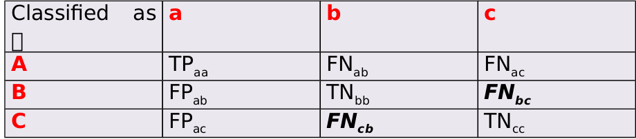
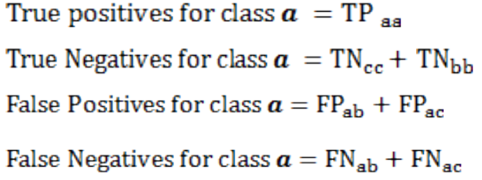

```{r setup, include=FALSE}
knitr::opts_chunk$set(echo = TRUE, cache = TRUE)

library(tidyverse)
library(caTools)
library(ROCR)
library(rpart)
library(rpart.plot)
library(randomForest)
library(caret)
library(e1071)
```

# 1. Case Study: IRIS Classification

## **The Problem: Given a set of data about the flowers (column 1 through 4) can we predict which of the 3 classes of flowers it belongs to.**

Source from [here](https://rpubs.com/rpadebet/269829)

## Loading the data from within R

```{r}
# Attach the dataset to the environment
data(iris)
# Get help on the data
help(iris)
# Rename the data
iris_dataset<-iris
# View the data
View(iris_dataset)
```

```{r}
str(iris_dataset)
```

## Splitting the Data into Training and Testing Sets

We use the dataset to create a partition (80% training 20% testing)
```{r}
index <- createDataPartition(iris_dataset$Species, p = 0.80, list = FALSE)
str(index)
```
Select 20% of the data for testing
```{r}
testset <- iris_dataset[-index,]
```
Select 80% of data to train the models
```{r}
trainset <- iris_dataset[index,]
```

## Modelling

**The Problem: Given a set of data about the flowers (column 1 through 4) can we predict which of the 3 classes of flowers it belongs to.**

### 1. Decision Tree 

```{r}
iris.CART <- rpart(Species ~ ., data = trainset, method = "class", minbucket = 25)
```
Now let's plot our tree using the prp function, where the only argument is the name of our model, StevensTree.
```{r}
prp(iris.CART)
```

## Prediction and Metrics

For Multiclass prediction task, the result is usually displayed in confusion matrix where there is a row and a column for each class:  
+ Each matrix element shows the number of test instances for which the actual class is the row and the predicted class is the column  
+ Good results correspond to large numbers down the diagonal and small values (ideally zero) in the rest of the  



For example in three classes task {a , b , c} with the confusion matrix below, if we selected a to be the class of interest then:  



### Predictions on train!!! dataset

```{r}
predict.train <- predict(iris.CART, newdata = trainset, type = "class")
```

#### Q: Contingeny table: how rows and columns relate to input arguments?

```{r}
table(trainset$Species, predict.train, dnn = list("actual", "prediction"))
```
Actual number of species:
```{r}
table(trainset$Species)
```
Prediction number of species
```{r}
table(predict.train)
```

#### Q: How to calculate TP, TN, FP, FN?

```{r}
cm <- confusionMatrix(data = trainset$Species, # actual data
                reference = predict.train,               # predicted data
                mode = "prec_recall",               # choose recall-precise method
                dnn = c("Reference", "Prediction")) # rows for actual data, columns - for predicted
cm
```


#### Q: What about threshold value? (prevalence parameter)

```{r}
confusionMatrix(reference = trainset$Species, 
                data = predict.train,         
                mode = "prec_recall",         
                dnn = c("Reference", "Prediction"),
                prevalence = c("setosa" = 0.33, "versicolor" = 0.33, " virginica" = 0.33))
```
```{r}
table(trainset$Species)
```


### Additional information about metrics:

1) confusinMatrix() help page    
2) [CLASSIFICATION ACCURACY ASSESSMENT](http://www.50northspatial.org/classification-accuracy-assessment-confusion-matrix-method/)  
3) [Simple guide to confusion matrix terminology](https://www.dataschool.io/simple-guide-to-confusion-matrix-terminology/)  
  
### Predictions on test dataset

Now let's see how well our CART model does at making predictions for the test set.
```{r}
PredictCART <- predict(iris.CART, newdata = testset, type = "p")
```
Now let's compute the accuracy of our model by building a confusion matrix.
```{r}
confusionMatrix(testset$Species, PredictCART,
                mode = "prec_recall",               
                dnn = c("Reference", "Prediction"))
```

### 2. Random Forest

Build the model
```{r}
random.forest <- randomForest(user_id ~ ., data = train.data, nodesize = 25, ntree = 200)
```

Make prediction
```{r}
predict.RF.test <- predict(random.forest, newdata = test.data)
```
See result
```{r}
confusionMatrix(reference = test.data$user_id, data = predict.RF.test,         
                mode = "prec_recall", dnn = c("Reference", "Prediction"))
```
