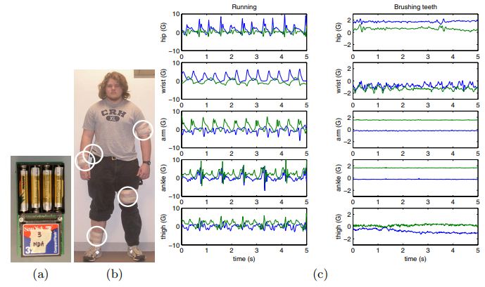

```{r setup, include=FALSE}
knitr::opts_chunk$set(echo = TRUE, echo = TRUE,
                      fig.width = 9)

library(tidyverse)
```

# Agenda

1. Project description  
2. Experiment design  
2. Data preparetion and exploration  
3. Features extraction  
4. Data modelling  


# Project description

## What about task?  
  
Задача: обучившись на одном человеке, модель должна уметь отличить его от других. То есть когда подаём на вход его записи - выдаё 1, во всех остальных случаях - 0
  
## What about data?
  
[Activity Recognition from Single Chest-Mounted Accelerometer Data Set](https://archive.ics.uci.edu/ml/datasets/Activity+Recognition+from+Single+Chest-Mounted+Accelerometer)
    
## How does raw data looks like?

```{r, echo=TRUE}
person1 <- read.csv("../data/raw/1.csv") %>%
  filter(X1 > 0) %>% 
  rename(id = X0, ax = X1502, ay = X2215, az = X2153, activity = X1)
```

Set activity names:
```{r}
activity_vec <- c("Working_at_Computer",
                  "Standing_Up+Walking+Going_up-down_stairs",
                  "Standing",
                  "Walking",
                  "Going_Up-Down_Stairs",
                  "Walking+Talking",
                  "Talking_while_Standing")
X1_to_activity <- seq(1:7)
names(X1_to_activity) <- activity_vec
```

Make data variables more readable:
```{r}
read.csv("../data/raw/1.csv") %>% 
  filter(X1 > 0) %>% 
  rename(time = X0, ax = X1502, ay = X2215, az = X2153) %>% 
  mutate(activity = names(X1_to_activity[X1])) %>% 
  select(-X1) -> person1
person1[1:10,]
```

**Activities summary:**
```{r}
person1 %>% 
  count(activity) %>% 
  mutate(second = n / 52)
```

How different activities look like
```{r}
person1 %>% 
  filter(activity != "Standing_Up+Walking+Going_up-down_stairs") %>%   
  ggplot(aes(x = time, y = ax)) +
    geom_line() +
    facet_wrap(activity ~ ., scales = "free")
```

## Useful paper

**1)[Person Recognition using Smartphones’ Accelerometer Data](https://arxiv.org/pdf/1711.04689.pdf)**  

**2) [Activity Recognition from User-Annotated Acceleration Data](http://citeseerx.ist.psu.edu/viewdoc/download?doi=10.1.1.839.8212&rep=rep1&type=pdf)**  



**3) [A systematic analysis of performance measures for classification tasks] (http://rali.iro.umontreal.ca/rali/sites/default/files/publis/SokolovaLapalme-JIPM09.pdf)**  
  
  
   
# Experiment design

### 1) Get data from 10 users  
  
### 2) Choose one activity: walking (#4)  
  
### 3) Data cleaning and trasformation for features extraction

### 4) Data exploration  
  
### 5) Features extraction
  
### 6) Modelling data by using:  
   **- decision tree;**  
   **- random forest;**  
   **- k-NN;**  
   
### 7) Analysing result  
  
  
## Features to be extracted:
  
* The raw data is divided into identification intervals of 100 samples width with 50% overlap  
  
* Both time and frequency domain features are extracted. The Fast Fourier Transform (FFT) of the axial data of the identification windows for each of the axes is evaluated, which forms the base for all frequency domain features  
  
## The parameters extracted from the identification windows, which serve as the features for the classification problem are defined as follows:  
  
### Mean  

The mean values of the triaxial accelerometer data within each window are calculated for both the raw data and the FFT data for each of the three axes, which gives us a set of six mean values, abstracting data in both time and frequency domains:  
  
1) raw_mean_ax;  
2) raw_mean_ay;  
3) raw_mean_az;  
4) fft_mean_ax;  
5) fft_mean_ay;  
6) fft_mean_az;  
    
### Median

The median is calculated in a similar way as the mean. The median values are calculated for each of the axes taken in a similar way for both time and frequency domains for each of the three axes:  
  
7)  raw_median_ax;  
8)  raw_median_ay;  
9)  raw_median_az; 
10) fft_median_ax;   
11) fft_median_ay;  
12) fft_median_az;  
  
### Magnitude  

The magnitude is defined as the average of the root mean square of the tri-axial data (both time and frequency domain), and is calculated as follows:  
$M = \sum_{k = 1}^l{\sqrt{x_k^2 + y_k^2 + z_k^2}) over l$,  
where:  
$x_k, y_k, z_k$ - Instantaneous acceleration values  
l - Length of window   
  
The magnitude for frequency domain is calculated by putting instantaneous values of fourier transformed data in place of acceleration:  
13) raw_mag;  
14) fft_mag;  

### Cross-correlation  

The cross-correlation is defined as the ratio of mean of x axis and z axis data and that of y axis and z axis data. The z axis is selected as the frame of reference as it remains constant for almost all possible orientations of the smartphone, and the ratios are taken with respect to z axis. The cross correlation of z axis with x axis and y axis are mathematically defined as follows:  
$Corr _xz = x_ mean / z_ mean$;  
$Corr _yz = y_ mean / z_ mean$,  
where:  
$Corr _xz$ - Cross-correlation of x-axis & z-axis,  
$Corr _yz$ - Cross-correlation of y-axis& z-axis  
  
15) raw_corr_xz;  
16) raw_corr_yz;  
17) fft_corr_xz;  
18) fft_corr_yz;  

### Peak Count  
  
Peak count for each axis refers to the number of local maxima for the axial data in the identification window. The average of the peak count over the three axes for the time domain data is selected as a feature  
  
19) peak_ax;  
20) peak_ay;  
21) peak_az;  
  
### Distance between Peaks  

Distance between peaks refers to the average time interval between two successive peaks in a window  
  
22) peak_dist_ax;    
23) peak_dist_ay;   
24) peak_dist_az;  
  
### Spectral Centroid  
  
Spectral centroid is a measure used to characterise a spectrum. In this case, spectrum refers to the identification window of acceleration values. It indicates where the center of mass of the spectrum is. The spectral centroid of each window for the three axes using the FFT values as weights is given by:  
$Centroid = \sum_ { k = 1 }^l { x_tk f_tk } \over { l }$  
where:  
$x_tk$ - Instantaneous acceleration   
$f_tk$ - Instantaneous value of FFT  
l      - length of window  
  
25) spectral_centr_ax;  
26) spectral_centr_ay;  
27) spectral_centr_az;  
  
### Average Difference from Mean  

The absolute difference from mean of the window for each axis (time domain) is calculated as follows:  
$Diff_x = Avg( |{ x_t - x_mean }| )$  
where:  
$Diff_x$ - Difference from mean   
$x_t$    - Instantaneous acceleration  
   
28) diff_mean_ax;  
29) diff_mean_ay;  
30) diff_mean_az;  
  