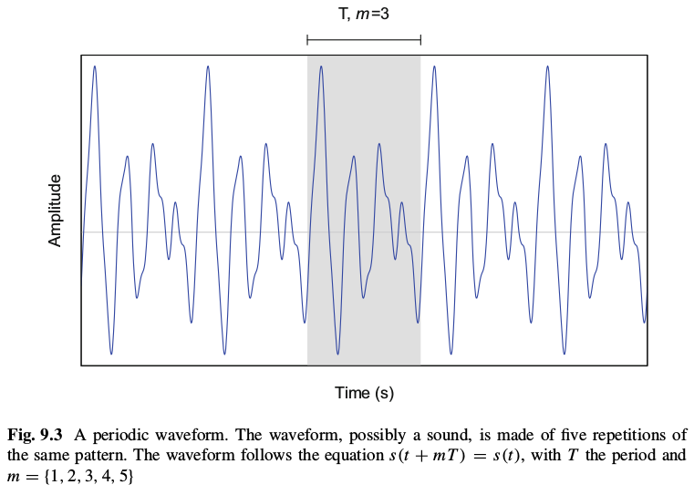

```{r setup, include=FALSE}
knitr::opts_chunk$set(echo = TRUE)

library(tidyverse)
library(tuneR)
```

## Amplitude
  
+ Instantaneous amplitude  
+ Maximum amplitude  
+ Peak-to-peak  
+ Root-mean-square amplitude (rms, RMS)  
(ch. 2.2.3. p.12-13)  
  
crest amplitude - максимальна амплітуда  
  

## Frequency (ch.2.2.6, p.21)  
  
## Sampling and Quatization (ch 2.4.1, p.30)  
  
**sampling frequency, sampling rate** - частота дискретизації  
**Sampling** - дискретизація  
**Amplitude Envelope** - огинаюча амплітуди  

[Sampling Theory](https://www.vicmyers.com/wp-content/uploads/spectrum_analysis.pdf)

## Smoothing. Sliding Window Process (ch.5.2.3, p.130)  
  
  
Moving Average
  
## Fourie Transform  (ch.9, p.216)
  
+ **Fourier series (FS)** - Decomposition of a periodic signal into an infinite sum of harmonics  

+ **Fourier transform (FT)** - Transformation of an infinite signal from the time (or spatial) domain to the frequency domain  

+ **Discrete Fourier transform (DFT)** - Transformation of a discrete time-limited signal to a discrete frequency spectrum  

+ **Fast Fourier transform (FFT)** - Mathematical tool and algorithm to compute the DFT  
The FFT is not another kind of Fourier transformation but a tool in mathematics, or algorithm in computer
sciences, that can process the DFT very efficiently.  

+ **Short-time Fourier transform (STFT)** - Sliding FT along an infinite signal  

+ **Short-time discrete Fourier transform (STDFT)** - Sliding DFT along a time-limited signal  
  
### FFT  
  
(p.226)
However the total energy of the time and frequency signals are preserved as stated
by Parseval’s theorem which stipulates that the sum of the square of a function is
equal to the sum of the square of its transform.
  
## Amplitude Scales (ch.9.5, p.235)  
  

## Key concepts  
  
Sliding windows ()
Sampling  
skewness (p.171)  
kurtosis (p.171)  
Amplitude Modulation Analysis (ch.8, p.205)  

# Example Fourier Transform  
  
(from book sueur_j_sound_analysis_and_synthesis_with_r, p.219)  
  


The waveform shown in Fig. 9.3 obeys to the following equation:  
$s( t ) = 0.5 + 0.3cos( t )+2sin( 2t )+3sin( 3t)-4cos( 4t )+sin( 10t )$  
Imagine that this waveform is a sound sampled at a frequency $f_s = 44,100$ during 1 s with a fundamental frequency $f_0 = 440 Hz$. The waveform is therefore made of 44,100 samples with a period 44,100 ÷ 440 = 100.2273 samples that can be approximated to 100 samples. We can try to find the coefficients (An , Bn) with the formula above. We start by generating the 440 Hz sound with:  
```{r}
f <- 44100                         # sampling frequency
t <- seq(1/f, 1, length.out=f)     # time
T <- 1/440                         # 440 Hz period
w0 <- 2*pi/T                       # 440 Hz angular frequency
h0 <- 0.3*cos(w0*t)                # 440 Hz fundamental frequency
h1 <- 2*cos(2*w0*t)                # 880 Hz harmonic
h2 <- 3*sin(3*w0*t)                # 1320 Hz harmonic
h3 <- -4*cos(4*w0*t)               # 1760 Hz harmonic
h10 <- 10*sin(10*w0*t)             # 4400 Hz harmonic
s <- 0.5 + h0 + h1 + h2 + h3 + h10 # final signal
```
NOT CORRECT!!! Signal reconstruction  
```{r}
plot(s[1:200], type = "l")
```
  
In R, the FFT is implemented in the function fft(). The use of this function is rather simple; we just need to provide the signal as an input:
```{r}
fft2 <- fft(s)
#spectrum(fft2)
```
To produce the discrete frequency spectrum, we have to compute the complex modulus of the FFT, directly obtained with the function Mod()
```{r}
fspec <- Mod(fft2)
```
The frequency spectrum can be visualized by calling plot() with type="h" to draw a vertical line corresponding to the amplitude of each angular frequency. The frequency resolution is here 1 Hz because the sound analyzed lasts 1 s.
```{r}
plot(fspec, type="h", col="blue", xlab="Frequency (Hz)", ylab="Amplitude (no unit)")
```
Figure 9.7 shows that the modulus of the Fourier transform is a symmetric, or mirrored, function around half the sampling frequency or Nyquist frequency $f_N$ , here $f_N = f _s ÷ 2 = 22,050 Hz$. This symmetry is one of the main properties of the Fourier transform due to the symmetric properties of the cosine and sine functions.  
We zoom in on the left half of the spectrum, and we multiply the amplitude values by 2 to keep the total amount of energy:
```{r}
fspec.left <- 2*fspec[1:(f/2)]
plot(fspec.left, type="h", col="blue", xlab="Frequency (Hz)", ylab="Amplitude (no unit)")
```
Identify peaks (manual)
```{r}
#peaks <- identify(fspec.left)
peaks <- c(0, 440, 880, 1320, 1760, 4400)
```

```{r}
x.spec <- spectrum(fspec, log = "no", span = 5, plot = FALSE)
spx <- x.spec$freq / T 
spy <- 2*x.spec$spec
plot(spy[1:100] ~ spx[1:100], xlab="frequency",ylab="spectral density",type="l")
```
Explore spectrum function
```{r}
par(mfrow = c(2,2))
plot(lh)
spectrum(lh)
spectrum(lh, spans = 3)
spectrum(lh, spans = c(3,3))
# spectrum(lh, spans = c(3,5))
# 
spectrum(ldeaths)
# spectrum(ldeaths, spans = c(3,3))
# spectrum(ldeaths, spans = c(3,5))
# spectrum(ldeaths, spans = c(5,7))
# spectrum(ldeaths, spans = c(5,7), log = "dB", ci = 0.8)
```

